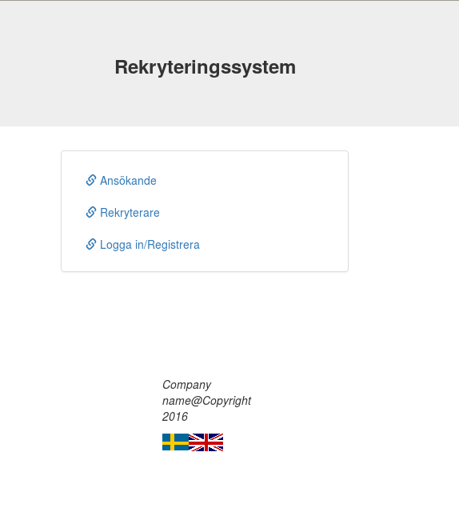

# Recruitment System

## Description

Web-based recruitment system with interfaces both for applicants and recruiters. Part of a assignment in a course at KTH Royal Institute of Technology.

## How to run

Run the project from inside NetBeans or other IDE that has integrated support for Glassfish server

## Documentation

- Arhitectural document can be found in the folder "report"
- JavaDoc at target/site/apidocs/index.html

## Author

Kim Hammar, Alexander Lundh, Marcel Mattsson

## Copyright and license

The MIT License (MIT)

Copyright (c) 2015 Kim Hammar, Alexander Lundh, Marcel Mattsson